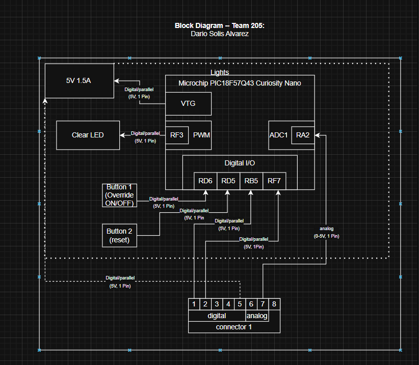

## Overview
First rendition of the individual block diagram that connects to the rest of Team 205's boards. This board focuses on the lighting the system and the implementation of the Overide On/Off button and a reset. The device is planned to be powered by the 5V VBUS output. This section recieves the already deciphered readings from the motion and sound detectors and had the light behave accordingly.

## Example Block Diagram 
 

