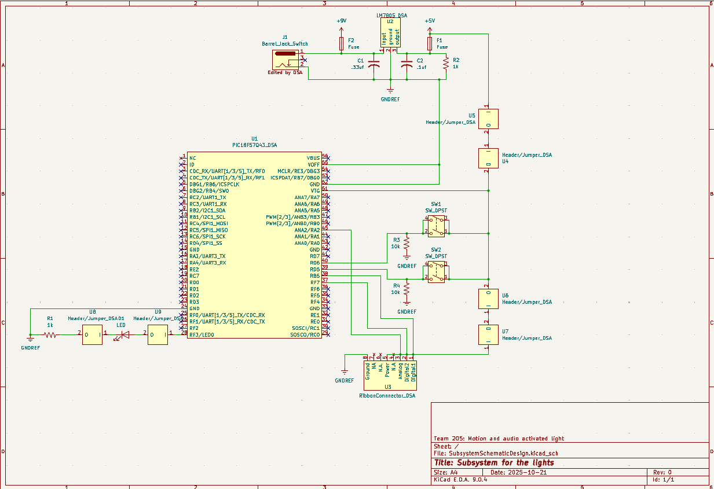

## Overview

This schematic is design in conjunction with team 205's project to design and dedvelop a motion and audio sensing light. This schematic is the output of the system, showing the actual activation of the light after all the input information has been digested and sent to this subsystem.

{style width:"350" height:"300;"}
**Figure 04:** Showing the output schematic for the light.

## Resouces

The schematic as a PDF download is available [*here*](SubsystemSchematicDesign.pdf), and the Zip folder of the project [*here*](SubsystemSchematicDesign.zip).